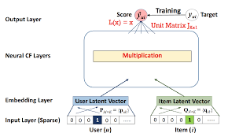
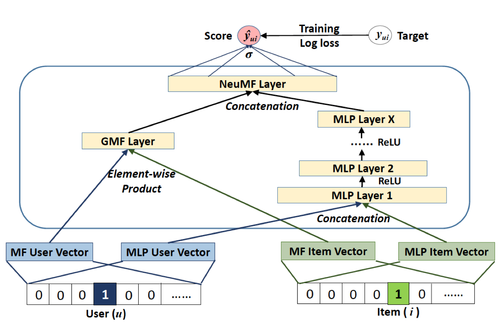
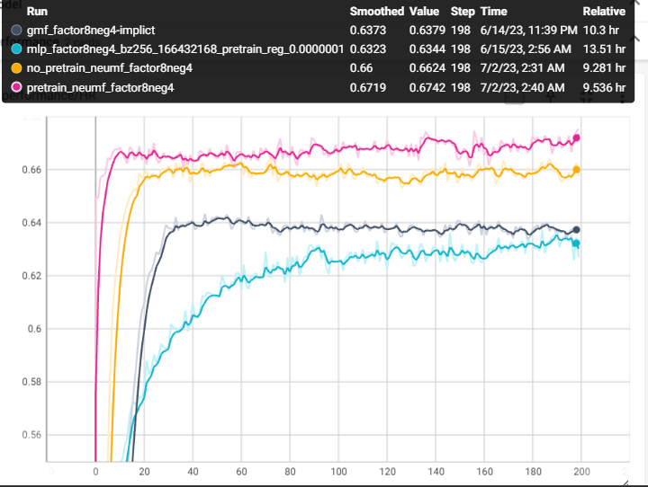

# Neural_Network_Based_Collaborative_Filtering
- Model replaces the inner product between latent vectors in the Matrix Factorization technique with a deep neural network. The neural network learns non-linear mapping between latent vectors and their interaction value.
- This repository has three different implementations
  - ### Generalized Matrix Factorization (GMF)
      - This is a generalised version of Matrix Factorization, where it decides(through learning) which element of the latent vector to be weighted more.
  - ### Multi Layer Perceptron(MLP)
      - It contains multiple layers to map latent vectors of the user and item to their interaction value.
  - ### Neural Matrix Factorization (NeuMF)
      - It combines both the ideas of GMF and MLP to map latent vectors of user and item to their interaction value.
   
- All models are trained on the **MovieLens-1M** dataset.
- Dataset is converted as binary i.e. interacted values as 1 and un-interacted as 0.
- To ensure the model doesn't learn to output 1 always, I have used 4 random negative samples(un-interacted) per user into training data.

## Model Architectures
### GMF

### MLP

### NeuMF

## Evaluation
### Leave-one-out-accuracy 
- For each user, we held-out his/her latest interaction as the test set and utilised the remaining data for training. Since it is too time-consuming to rank all items for every user during evaluation, we followed the strategy of randomly sampling "99 items+1 item of held out" that are not interacted by the user, ranking the test item among the 100 items. The performance of a ranked list is judged by Hit Ratio(HR). HR intuitively measures whether the test item is present on the top-10 list of 100 items.

## Results

**X-axis** - Epoch number, 
**Y-axis** - Hit Rate
